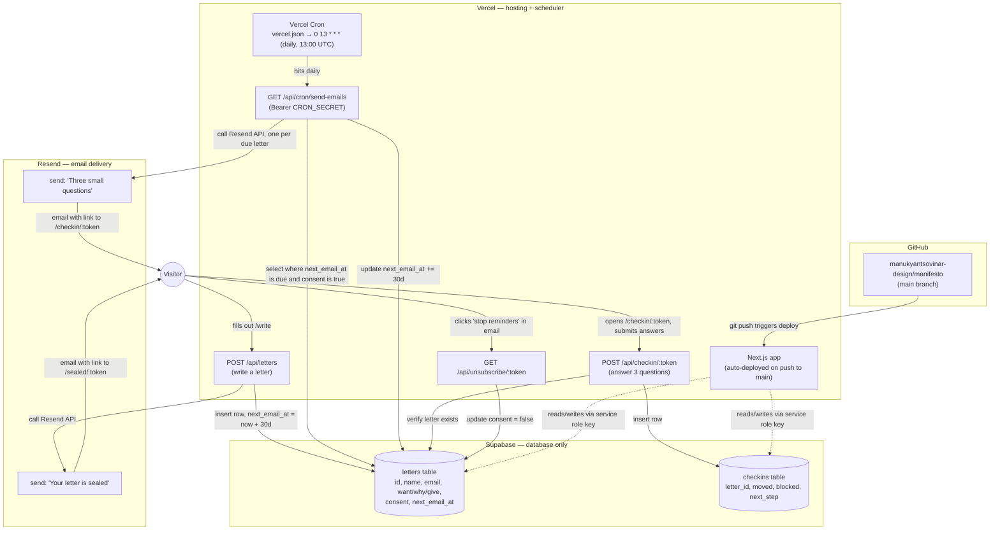

# Stack architecture

How Vercel, Supabase, and Resend fit together for this project. See [README.md](README.md) for setup/env vars.

## What each service does

- **Vercel** — hosts the Next.js app and its API routes, redeploys automatically on every push to `main`, and runs the daily cron job (`vercel.json`) that drives the 30-day email cycle. All secrets (`SUPABASE_URL`, `SUPABASE_SERVICE_ROLE_KEY`, `RESEND_API_KEY`, `EMAIL_FROM`, `SITE_URL`, `CRON_SECRET`) live in Vercel → Project → Settings → Environment Variables.
- **Supabase** — Postgres database only, nothing else. Two tables: `letters` (one row per person, tracks `next_email_at` for the 30-day cycle and `consent` for unsubscribes) and `checkins` (one row per monthly answer, foreign-keyed to `letters`). Row-level security is on with zero policies — the app only ever reaches it server-side with the `service_role` key, so it's unreachable directly from a browser.
- **Resend** — the actual email sender. Two templates: the immediate "Your letter is sealed" confirmation (sent from `/api/letters`) and the monthly "Three small questions" check-in (sent from the cron route). Free tier: 100 emails/day, 3,000/month.

## The two triggers that move data

1. **Someone writes a letter** → `/api/letters` inserts into `letters` with `next_email_at` set 30 days out, then immediately asks Resend to send the confirmation email.
2. **Vercel Cron fires once a day** → `/api/cron/send-emails` asks Supabase who's overdue, asks Resend to email each of them, then pushes their `next_email_at` forward another 30 days. This repeats indefinitely and doesn't depend on anyone actually answering a given month's check-in.
